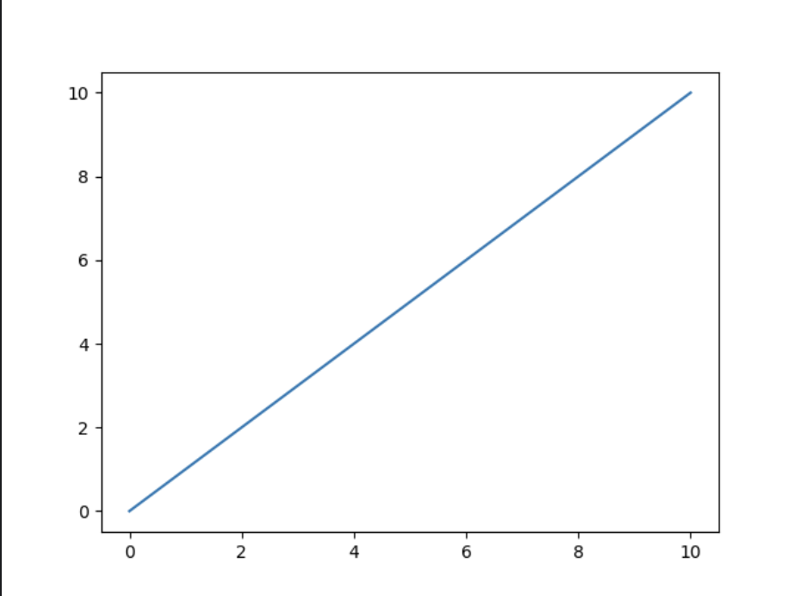
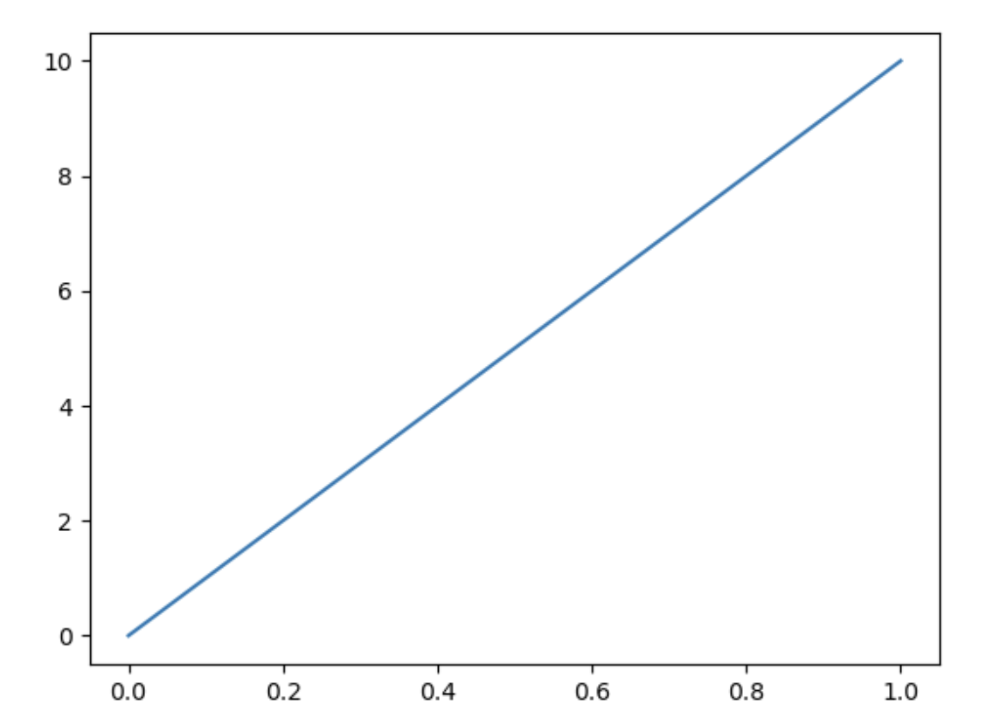
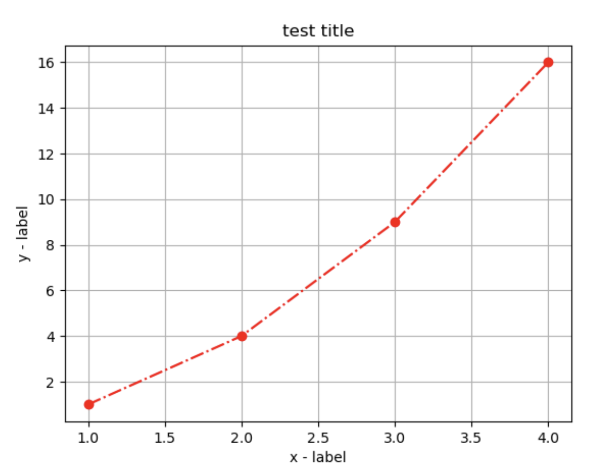

继续扩充几个库使用

> 直通车：https://www.runoob.com/ml/ml-python.html

# Matplotlib

是一个绘图的基础库，配合`numpy`库使用手感更佳

## 1. Pyplot

Pyplot 是 Matplotlib 的子库，提供了和 MATLAB 类似的绘图 API。它是常用的绘图模块，能很方便让用户绘制 2D 图表。

Pyplot 包含一系列绘图函数的相关函数，每个函数会对当前的图像进行一些修改，例如：给图像加上标记，生新的图像，在图像中产生新的绘图区域等等。

- 常用pyplot函数

  ```
  plot()：用于绘制线图和散点图
  scatter()：用于绘制散点图
  bar()：用于绘制垂直条形图和水平条形图
  hist()：用于绘制直方图
  pie()：用于绘制饼图
  imshow()：用于绘制图像
  subplots()：用于创建子图
  ```

举个🌰

```python
import matplotlib.pyplot as plt
import numpy as np

xpoints = np.array([0, 10])
ypoints = np.array([0, 10])

plt.plot(xpoints, ypoints)
plt.show()
```



得到如上基础二维图像，`plot()`可自定义内容很多，比如：

**颜色字符：**'b' 蓝色，'m' 洋红色，'g' 绿色，'y' 黄色，'r' 红色，'k' 黑色，'w' 白色，'c' 青绿色，'#008000' RGB 颜色符串。多条曲线不指定颜色时，会自动选择不同颜色。

**线型参数：**'‐' 实线，'‐‐' 破折线，'‐.' 点划线，':' 虚线。

**标记字符：**'.' 点标记，',' 像素标记(极小点)，'o' 实心圈标记，'v' 倒三角标记，'^' 上三角标记，'>' 右三角标记，'<' 左三角标记...等等。

```python
# 写法如下
plt.plot(x, y, 'fmt')

"""
例如: plt.plot(x, y, 'bo--')
表示蓝色、实心圆、坡折线
"""
```

- 若不指定x的点，则x会根据y的长度来设置，x轴为`[0, len(y) - 1]`

  例子如下:

  ```python
  import matplotlib.pyplot as plt
  import numpy as np
  
  ypoints = np.array([0, 10])
  
  plt.plot(ypoints)
  plt.show()
  ```

  

### 正余弦

```python
import matplotlib.pyplot as plt
import numpy as np

x = np.arange(0, 4*np.pi, 0.1)   # start,stop,step
y = np.sin(x)
z = np.cos(x)
plt.plot(x, y, x, z)
plt.show()
```

很明了，这里绘制了两条线，也可同理plt可绘制多条线

其余的函数、元素使用，遇到再查即可

## 轴标签和标题

使用 **xlabel()** 和 **ylabel()** 方法来设置 x 轴和 y 轴的标签

使用 **title()** 方法来设置标题

```python
import numpy as np
import matplotlib.pyplot as plt

x = np.array([1, 2, 3, 4])
y = np.array([1, 4, 9, 16])
plt.plot(x, y, marker='<', linestyle='--', color='b')

plt.title("test title")
plt.xlabel("x - label")
plt.ylabel("y - label")

plt.show()
```


## 网格线

使用 pyplot 中的 `grid()` 方法来设置图表中的网格线

```python
import numpy as np
import matplotlib.pyplot as plt

x = np.array([1, 2, 3, 4])
y = np.array([1, 4, 9, 16])
plt.plot(x, y, marker='o', linestyle='-.', color='r')

plt.title("test title")
plt.xlabel("x - label")
plt.ylabel("y - label")
plt.grid() # 网格线默认值

plt.show()
```



```python
plt.grid(b=None, which='major', axis='both', )
"""
b：可选，默认为 None，可以设置布尔值，true 为显示网格线，false 为不显示，如果设置 **kwargs 参数，则值为 true。
which：可选，可选值有 'major'、'minor' 和 'both'，默认为 'major'，表示应用更改的网格线。
axis：可选，设置显示哪个方向的网格线，可以是取 'both'（默认），'x' 或 'y'，分别表示两个方向，x 轴方向或 y 轴方向。
**kwargs：可选，设置网格样式，可以是 color='r', linestyle='-' 和 linewidth=2，分别表示网格线的颜色，样式和宽度。
"""
```

## Matplotlib的方法

给出一些感觉能用上的方法，主要还是要用再查

### imshow()

```python
plt.imshow(X, cmap=None, norm=None, aspect=None, interpolation=None, alpha=None, vmin=None, vmax=None, origin=None, extent=None, shape=None, filternorm=1, filterrad=4.0, imlim=None, resample=None, url=None, *, data=None, **kwargs)

"""
X：输入数据。可以是二维数组、三维数组、PIL图像对象、matplotlib路径对象等。
cmap：颜色映射。用于控制图像中不同数值所对应的颜色。可以选择内置的颜色映射，如gray、hot、jet等，也可以自定义颜色映射。
norm：用于控制数值的归一化方式。可以选择Normalize、LogNorm等归一化方法。
aspect：控制图像纵横比（aspect ratio）。可以设置为auto或一个数字。
interpolation：插值方法。用于控制图像的平滑程度和细节程度。可以选择nearest、bilinear、bicubic等插值方法。
alpha：图像透明度。取值范围为0~1。
origin：坐标轴原点的位置。可以设置为upper或lower。
extent：控制显示的数据范围。可以设置为[xmin, xmax, ymin, ymax]。
vmin、vmax：控制颜色映射的值域范围。
filternorm 和 filterrad：用于图像滤波的对象。可以设置为None、antigrain、freetype等。
imlim： 用于指定图像显示范围。
resample：用于指定图像重采样方式。
url：用于指定图像链接。
"""
```

### insave()

用于将图像数据保存到磁盘上的函数

```python
plt.imsave(fname, arr, **kwargs)

"""
fname：保存图像的文件名，可以是相对路径或绝对路径。需指定后缀，例如 PNG、JPEG、BMP 等
arr：表示图像的NumPy数组。
kwargs：可选参数，用于指定保存的图像格式以及图像质量等参数。
"""
```

### imread()

从图像文件中读取图像数据

```python
plt.imread(fname, format=None)

"""
fname：指定了要读取的图像文件的文件名或文件路径，可以是相对路径或绝对路径。
format ：参数指定了图像文件的格式，如果不指定，则默认根据文件后缀名来自动识别格式。
"""
```

## Matplotlib显示中文

本来是不兼容中文字符，可以调字体参数来实现

```python
import matplotlib

a=sorted([f.name for f in matplotlib.font_manager.fontManager.ttflist])
for i in a:
    print(i)
```

先用如上代码可以获取本地系统里的字体库列表，然后用下列代码即可

```python
plt.rcParams['font.family'] = '字体'
# 例如 STFangsong(仿宋）、Heiti TC（黑体）
```

# SciPy

一个开源的 Python 算法库和数学工具包

## 模块列表

| 模块名            | 功能               | 参考文档                                                     |
| :---------------- | :----------------- | :----------------------------------------------------------- |
| scipy.cluster     | 向量量化           | [cluster API](https://docs.scipy.org/doc/scipy/reference/cluster.html) |
| scipy.constants   | 数学常量           | [constants API](https://docs.scipy.org/doc/scipy/reference/constants.html) |
| scipy.fft         | 快速傅里叶变换     | [fft API](https://docs.scipy.org/doc/scipy/reference/fft.html) |
| scipy.integrate   | 积分               | [integrate API](https://docs.scipy.org/doc/scipy/reference/integrate.html) |
| scipy.interpolate | 插值               | [interpolate API](https://docs.scipy.org/doc/scipy/reference/interpolate.html) |
| scipy.io          | 数据输入输出       | [io API](https://docs.scipy.org/doc/scipy/reference/io.html) |
| scipy.linalg      | 线性代数           | [linalg API](https://docs.scipy.org/doc/scipy/reference/linalg.html) |
| scipy.misc        | 图像处理           | [misc API](https://docs.scipy.org/doc/scipy/reference/misc.html) |
| scipy.ndimage     | N 维图像           | [ndimage API](https://docs.scipy.org/doc/scipy/reference/ndimage.html) |
| scipy.odr         | 正交距离回归       | [odr API](https://docs.scipy.org/doc/scipy/reference/odr.html) |
| scipy.optimize    | 优化算法           | [optimize API](https://docs.scipy.org/doc/scipy/reference/optimize.html) |
| scipy.signal      | 信号处理           | [signal API](https://docs.scipy.org/doc/scipy/reference/signal.html) |
| scipy.sparse      | 稀疏矩阵           | [sparse API](https://docs.scipy.org/doc/scipy/reference/sparse.html) |
| scipy.spatial     | 空间数据结构和算法 | [spatial API](https://docs.scipy.org/doc/scipy/reference/spatial.html) |
| scipy.special     | 特殊数学函数       | [special API](https://docs.scipy.org/doc/scipy/reference/special.html) |
| scipy.stats       | 统计函数           | [stats.mstats API](https://docs.scipy.org/doc/scipy/reference/stats.mstats.html) |

以几个常用模块进行举例

## 常量模块

-  、e、黄金比例

```python
from scipy import constants

print(f"Pi: {constants.pi}\ne: {constants.e}\nGolden Ratio: {constants.golden}")

"""
Pi: 3.141592653589793
e: 1.602176634e-19
Golden Ratio: 1.618033988749895
"""
```

- 国际单位词头(千的整次数幂)

| `yotta` | 10^24^  |
| ------- | ------- |
| `zetta` | 10^21^  |
| `exa`   | 10^18^  |
| `peta`  | 10^15^  |
| `tera`  | 10^12^  |
| `giga`  | 10^9^   |
| `mega`  | 10^6^   |
| `kilo`  | 10^3^   |
| `hecto` | 10^2^   |
| `deka`  | 10^1^   |
| `deci`  | 10^-1^  |
| `centi` | 10^-2^  |
| `milli` | 10^-3^  |
| `micro` | 10^-6^  |
| `nano`  | 10^-9^  |
| `pico`  | 10^-12^ |
| `femto` | 10^-15^ |
| `atto`  | 10^-18^ |
| `zepto` | 10^-21^ |

- 二进制

| `kibi` | 2^10^ |
| ------ | ----- |
| `mebi` | 2^20^ |
| `gibi` | 2^30^ |
| `tebi` | 2^40^ |
| `pebi` | 2^50^ |
| `exbi` | 2^60^ |
| `zebi` | 2^70^ |
| `yobi` | 2^80^ |

- 质量、角度、时间、长度、压强、面积、体积、速度、温度、能量、功率...其余用到再查